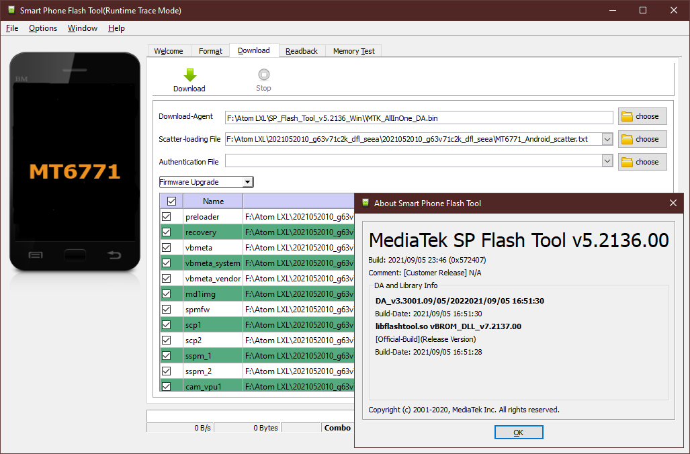

How to manually do a vendor upgrade (without loosing/wiping data).
=================================================

If you don't value your data you could just do a [regular vendor upgrade](HOW-TO-FLASH-STOCK.md) followed by a [regular Lineage installation](HOW-TO-INSTALL.md).
But if you value your current data/settings you need to do the following.
(Please do a backup anyway. I guarantee for nothing)

## Installing needed utilities

If you don't have the MTK drivers and the SPFlash tool already installed follow [the instructions from my other guide](HOW-TO-FLASH-STOCK.md).

## Downloading the Stock ROM

1. Download the [latest Stock ROM](https://drive.google.com/drive/folders/0By1nhWOmuw2KdDhTUlFOZHpXQjg?sort=13&direction=a&resourcekey=0-KHJPIYVPw2iHL--cceWyaw).
2. Extract the downloaded zip to a folder of your choosing.

## (Partially) Upgrading the stock rom

- [Atom L Region EEA (european union)](https://github.com/ADeadTrousers/twrp_device_Unihertz_Atom_L_EEA/releases)
- [Atom XL Region EEA (european union)](https://github.com/ADeadTrousers/twrp_device_Unihertz_Atom_XL_EEA/releases)
- [Atom L Region TEE (non-european union)](https://github.com/ADeadTrousers/twrp_device_Unihertz_Atom_L_TEE/releases)
- [Atom XL Region TEE (non-european union)](https://github.com/ADeadTrousers/twrp_device_Unihertz_Atom_XL_TEE/releases)

Attention: You need to make sure it is the corresponding release to your stock rom. Otherwise it will not boot (green bar on the top or other unexpected behaviours). 

1. Download `recovery.img` from the latest release page of your device.
2. Start `flash_tool.exe`.
3. Choose the scatter file from the directory you extracted the stock ROM into.
4. Select `Download only` from the dropdown menu.
5. Deselect `super`, `userdata`, `boot`, `vbmeta`, `vbmeta_system` and `vbmeta_vendor`.
6. Click on `recovery` and select the `recovery.img` you downloaded for your device.
7. Hit `Download`.
8. Power down your phone.
9. Connect your phone to your PC.
10. Turn on your phone.
11. The flashing should begin right away.
12. Restart the phone and press vol up to boot into the recovery.

## Upgrading the vendor partition

For the stock rom release 2021-05:

- [Atom L Region EEA (european union)](https://github.com/ADeadTrousers/android_device_Unihertz_Atom_L_EEA/releases/download/20210616-alpha/super-2021-05-eea.7z)
- [Atom XL Region EEA (european union)](https://github.com/ADeadTrousers/android_device_Unihertz_Atom_XL_EEA/releases/download/20210616-alpha/super-2021-05-seea.7z)
- [Atom L Region TEE (non-european union)](https://github.com/ADeadTrousers/android_device_Unihertz_Atom_L_TEE/releases/download/20210616-alpha/super-2021-05-tee.7z)
- [Atom XL Region TEE (non-european union)](https://github.com/ADeadTrousers/android_device_Unihertz_Atom_XL_TEE/releases/download/20210616-alpha/super-2021-05-stee.7z)

For the stock rom release 2021-11:

- [Atom L Region EEA (european union)](https://github.com/ADeadTrousers/android_device_Unihertz_Atom_L_EEA/releases/download/20220715-alpha/super-2021-11-eea.7z)
- [Atom XL Region EEA (european union)](https://github.com/ADeadTrousers/android_device_Unihertz_Atom_XL_EEA/releases/download/20220715-alpha/super-2021-11-seea.7z)
- [Atom L Region TEE (non-european union)](https://github.com/ADeadTrousers/android_device_Unihertz_Atom_L_TEE/releases/download/20220715-alpha/super-2021-11-tee.7z)
- [Atom XL Region TEE (non-european union)](https://github.com/ADeadTrousers/android_device_Unihertz_Atom_XL_TEE/releases/download/20220715-alpha/super-2021-11-stee.7z)

1. Download `super-YYYY-MM-XXX.7z` from the release page of your device which corresponds with the latest stock rom release.
2. Extract the modified copy of `super.img` from the downloaded archive.
3. Open a terminal or a command line window.
4. Run `adb push super.img /external_sd` on your PC.
6. In TWRP select `Install`.
7. Use `Select Storage` to switch to your SD card.
8. Use `Install Image` to switch to image installation mode.
9. Select `super.img` from the list.
10. Select `Super (Product, Vendor, System)` partition.
11. Swipe the slider on the bottom to the right to confirm.

## Upgrading LineageOS ROM 

- [Atom L Region EEA (european union)](https://github.com/ADeadTrousers/android_device_Unihertz_Atom_L_EEA/releases)
- [Atom XL Region EEA (european union)](https://github.com/ADeadTrousers/android_device_Unihertz_Atom_XL_EEA/releases)
- [Atom L Region TEE (non-european union)](https://github.com/ADeadTrousers/android_device_Unihertz_Atom_L_TEE/releases)
- [Atom XL Region TEE (non-european union)](https://github.com/ADeadTrousers/android_device_Unihertz_Atom_XL_TEE/releases)

1. Download `lineage-19.1-XXX-UNOFFICIAL-YYY-signed.zip` from the latest release page of your device.

### Using sideload method

1. From home screen in TWRP select `Advanced > ADB Sideload`.
2. Swipe the slider on the bottom to the right to confirm.
3. Run `adb sideload lineage-19.1-XXX-UNOFFICIAL-YYY.zip` from your PC.
4. Wait for the process to finish. The recovery might prompt something about verification failure, just ignore it and continue anyway.

### Using SD card

1. Run `adb push lineage-19.1-XXX-UNOFFICIAL-YYY.zip /external_sd` on your PC or transfer the file beforehand onto your SD card.
2. From home screen select `Install`.
3. Use `Select Storage` to switch to your SD card.
4. Select the previously transfered file.
5. Swipe the slider on the bottom to the right to confirm.

### Finishing up

1. (Optional) At this point, you can then install the latest Magisk and/or NikGapps at your will. If installing Magisk / NikGapps fails, you can try rebooting into recovery again in advanced menus, then try installing them again.
2. Select `Reboot System` to reboot into LineageOS and enjoy. Note that Magisk might cause your device to boot loop once or twice but it will eventually boot.
